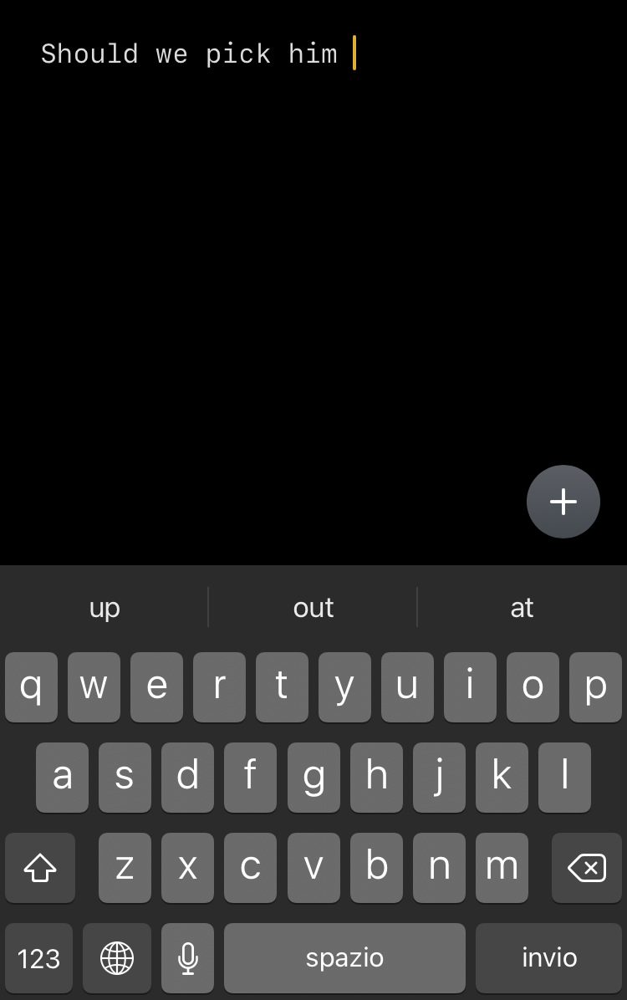
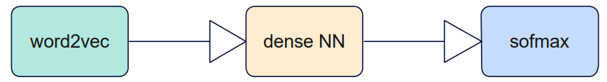

# The next word predictor
Inspired by the iPhone word predictor I am trying to recreate such a language model.


## Dataset
Both the Word2vec and neural network are train on the famous [dataset](http://ai.stanford.edu/~amaas/data/sentiment/) of movie reviews.

## Pipeline


### Word embedding
The Word2vec embedding was trained on the whole corpus, then applied when needed on the words. The embedding was evaluated by looking at most similar words and it was giving satisfying results, so I sticked with it. However, using a different approach may improve the performance. 
The biggest drawback is the fact that if a word didn't previously occur in the vocabulary the model cannot provide a prediction. It would make sense to apply a contextual embedding such as [BERT](https://arxiv.org/pdf/1810.04805.pdf).

### Neural network
As the first approach is with dense neural network (more accurate would be RNN, I will add LSTM in the future). As the input it takes hardcoded number (`PREVIOUS_WORDS_CONSIDERED` in [config.py](https://github.com/janfiszer/next-word-predictor/blob/main/config.py)) of vectorized words and as the output the is a layer with one neuron for each word in the vocabulary. Then after applying softmax activation function we get probability distribution for each word. 

## Results
Already some satisfying are at the end of [model-evaluation.ipynb](https://github.com/janfiszer/next-word-predictor/blob/main/model-evaluation.ipynb).

Example:
```
actually more important...
PREDICTED:
                     things: 54%
                       than: 56%
                        and: 70%
                      films: 71%
                     movies: 79%
``` 

 TODO:
- [ ] RNN instead of FNN
- [ ] Different word embedding (BERT) 


More coming soon...